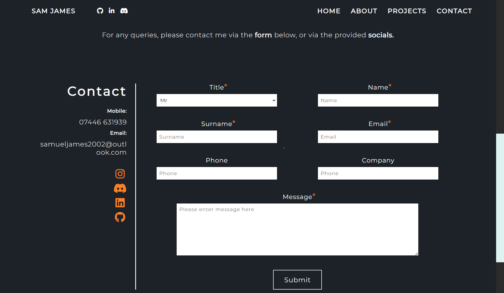
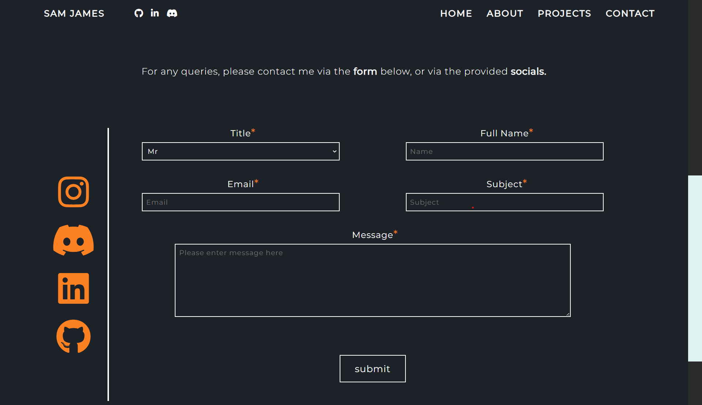
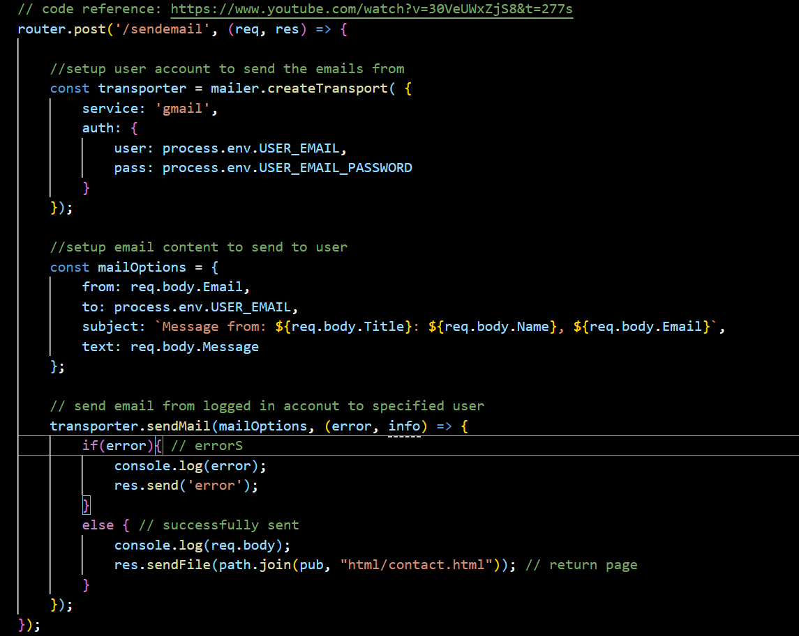
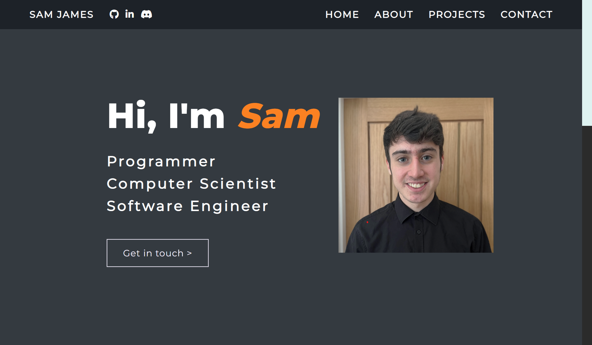
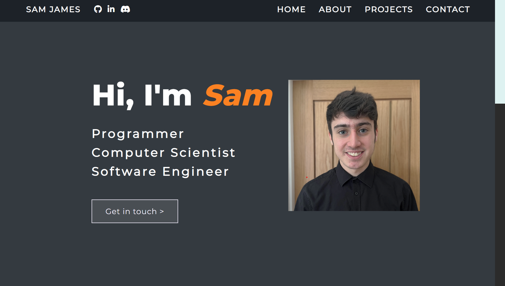
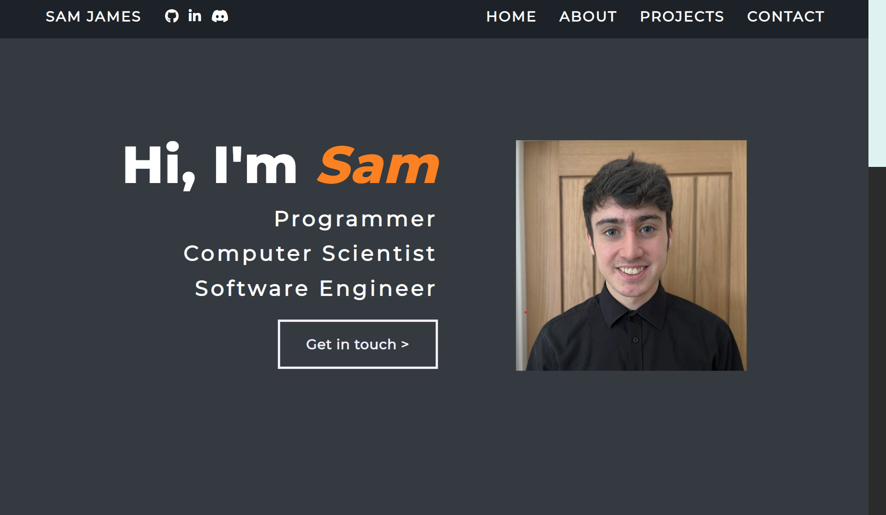
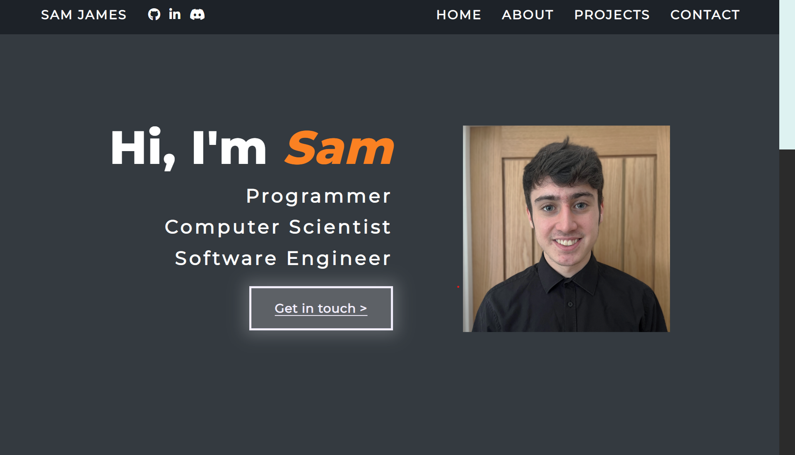
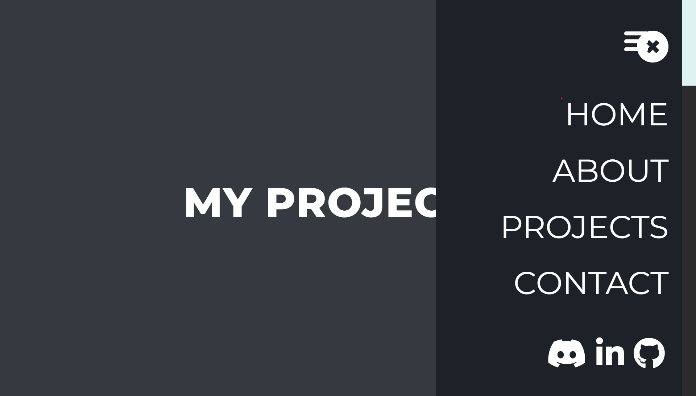
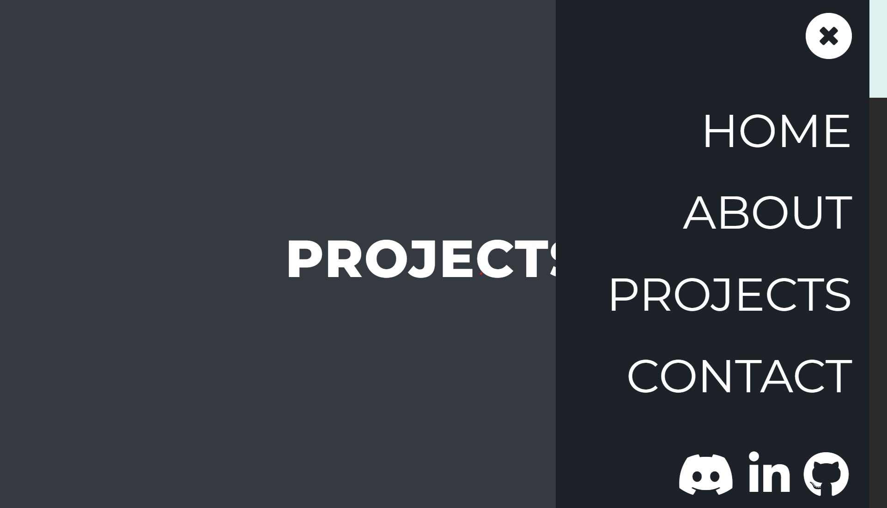

## HCI Analysis

For my portfolio website, I have undertaken a HCI analysis investigation.

### What is it? What does it involve?

HCI Analysis involves investigating how the users interact with the system itself, and looking for improvements of that interaction.
Key heuristics that are focused on involve:

*https://www.interaction-design.org/literature/article/how-to-conduct-a-heuristic-evaluation-for-usability-in-hci-and-information-visualization*

* Flexibility and site efficiency
* Aesthetic design
* Help and documentation
* User control
* Consistency
* Error prevention
* User acccessability

### My Implementation

To conduct my HCI investigation, here is the following approach that I took.

* I researched the different types of heuristics and features of a website that need to be measured.
* I created a google form covering different types of questions from different areas of the website, including:
	* Direct questions, e.g. Do you like this?
	* Number scales, e.g. How much out of 10 would you agree to this?
* I sent this form out to a number of my fellow colleagues to collect responses.

### My responses

Here are the generic responses that I recieved from the following questions, I had 3 responses.

1. How easy was it for you to find the information you wanted? (Hard 1, Easy 5)
4/5, 4/5, 5/5

2. Did you find the website structure easy to follow? (Easy 1, Hard 5)
1/5, 4/5, 4/5

3. Do you like looking at the website? (Hate 1, Love 5)
4/5, 4/5, 5/5

4. What device are you viewing this website on?
PC, PC, PC

5. How easy was it to read the presented information on your device? (Hard 1, Easy 5)
3/5, 4/5, 5/5

6. How would you rate the website's color scheme? (Hate 1, Love 5)
4/5, 5/5, 5/5

7. Do you like the fonts used? (Hate 1, Love 5)
4/5, 5/5, 5/5

Some of the positives that I recieved from the website were as follows:

* "about page was clean and effective but simple"
* "the layout of the pages was very clear and easy to understand"
* "the project cards"

### Suggestions for improvement

The common suggestions to improve the human computer interaction for my website were as follows:

* Remove phone number and email address from contact form, contact form should filter out spam contact requests without giving out info.
* The buttons could be more defined when hovering over them
* Issues with resizing windows, including email being cutoff before it moves

### Implementation of changes

In response to the feedback, I have modified my website in the following ways.

1. Removed phone number & email address from contact.html

2. Re-structured contact form plans from frontend to backend

At the time I had not coded the functionality for the sending of emails. However, origionally I was planning on sending it straight from the frontend. 
Due to feedback, I decided to instead code it via the backend so that I could hide my contact details from the user and reduce spam attempts.

3. Modified button styling & hover effects

I increased the border size of the buttons, and boldness of text. On hover, I added a glow effect, and underline effect to show hovering for user.

4. Fixed navbar issue on small screen devices

One issue with resizing windows was the smaller-screen navbar. The menuboards did not disappear on click, and sometimes caused error on navbar.

