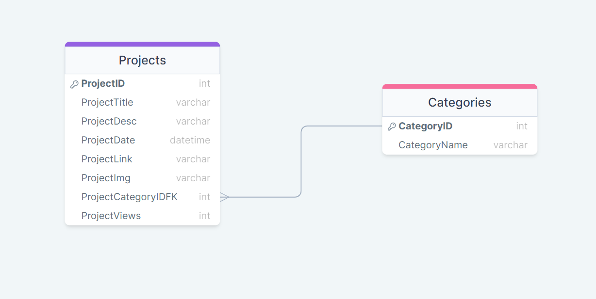
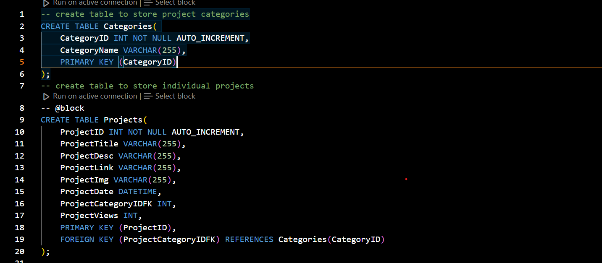
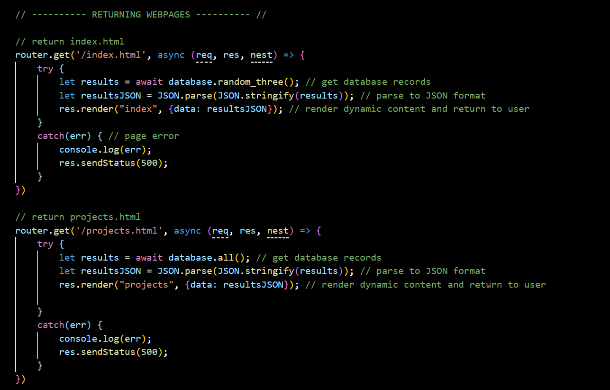
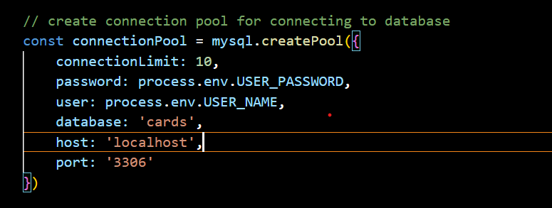
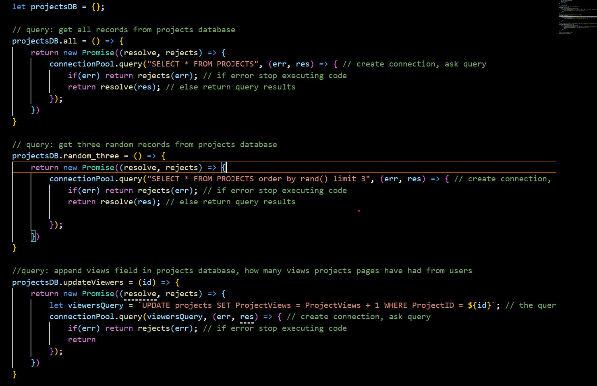
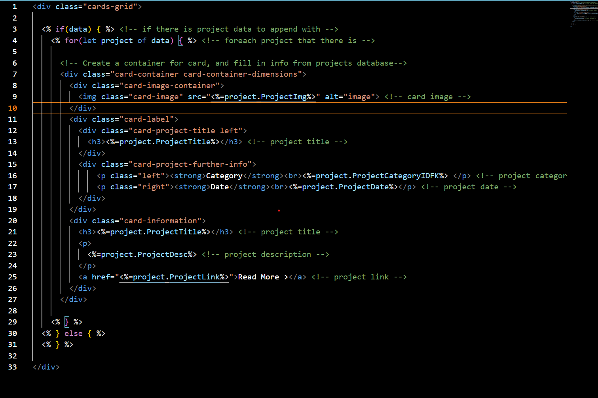
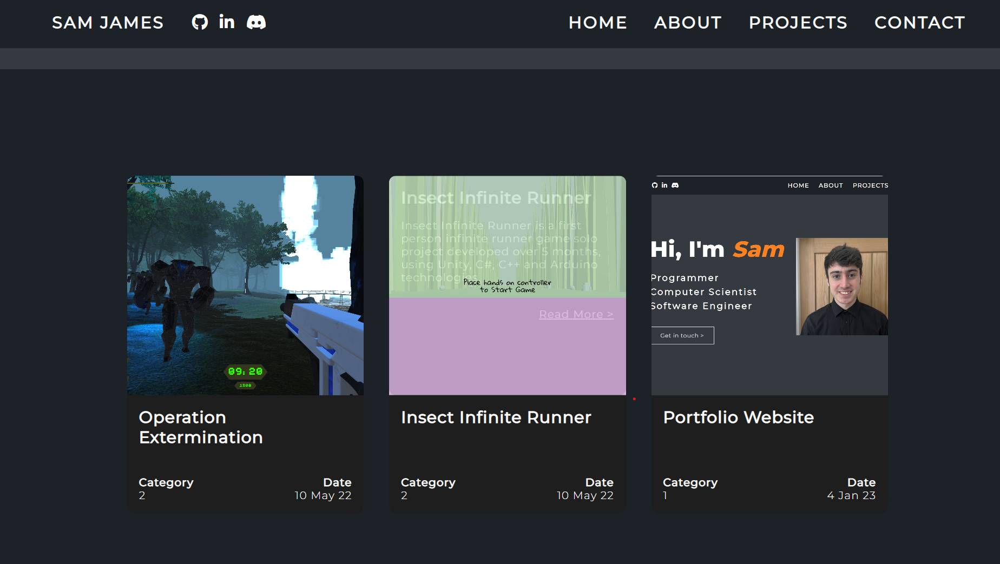

## Database

### Basic Description

* MySQL relational database
* Used to store information on my projects for the portfolio
* Website uses project cards, which are dynamically generated from the database data
* Includes 2 tables:
	* Projects - Different projects that I have completed
	* Categories - What type of project is it?

### Diagram

The Projects table has a many-to-one relationship with the Categories table. One category can have many projects, where as a project can only have one category.

### Projects Table

* ProjectID
* ProjectTitle - Name of project
* ProjectDesc - Description of project
* ProjectDate - Date of project
* ProjectLink - Link to page of project
* ProjectImg - Image of project for cards
* ProjectCategoryIDFK - Category of project
* ProjectViews - How many views the project link page has recieved

### Categories

* CategoryID
* CategoryName - Name of category

### Queries

* Access all data in Projects table
* Access 3 random records in Projects table
* Update ProjectViews record in Projects table

### Code Implementation

Here is the sql code that I used to create the tables in MySQL

Whenever a user loads the projects.html/index.html pages, a request is sent to the server to access the pages.
Depending on the page, a function is run to access a specific query.
Then, the html page is dynamically created using database data to display cards.

Login info to the database is stored in the code, using environment variables to protect the information on the local machine.

Here is showing the three queries in code. The database is passed one of the three queries, and executes the query.
If required, the function will return data to be used.

The html for the projects.html/index.html is dynamically rendered, and the database information is filled in.

Here's an example implementation for one of the pages, it includes the dynamically rendered html.

As a result, cards are now being rendered to the user on the page.

